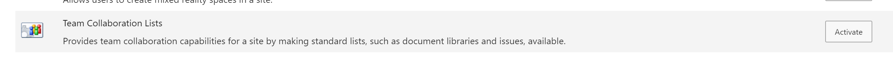
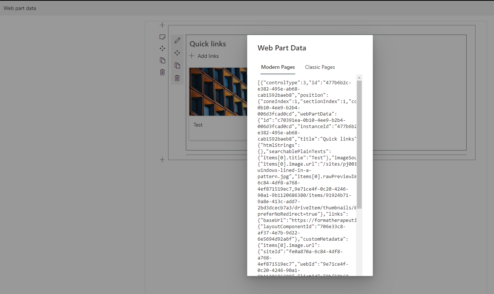
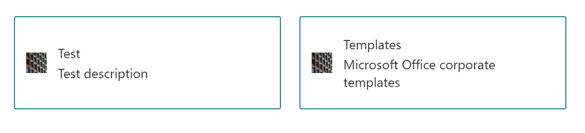

The modern Quick Links web part is slick, user-friendly, and (IMO) vastly superior to the classic Promoted Links web part.

When migrating from classic SharePoint to modern, you may have the need to convert a number of promoted links web parts to their modern counterparts. Migrations aside, knowing how to programmatically populate these modern web parts is incredibly useful. 

Modern Quick Link web parts do not use a SharePoint list, or any storage mechanism visible to the user for storing their links, other than through the web part itself. So how can we populate the web part with the links from a promoted links list. The answer is to use PowerShell to programatically add links from the list to the web part.

<Emphasis>
This tutorial assumes prior knowledge of PowerShell and the <a href="https://docs.microsoft.com/en-us/powershell/sharepoint/sharepoint-pnp/sharepoint-pnp-cmdlets?view=sharepoint-ps">SharePointPnPPowerShellOnline</a> cmdlets.
</Emphasis>

If you already have a promoted links list you want to use to populate a modern quick links web part, you can skip to the [next section](#quick-links-web-part-json-properties). Otherwise, let's create a promoted links list in our test site.

## Creating a Promoted Links List

By default, the ability to create Promoted Links lists, and other Team Collaboration lists is turned off in modern sites. So we’ll need to turn on that feature first.
1. Go to Site Settings.
2. Click *Manage site features*.
3. Activate *Team Collaboration Lists*.



Return to you site contents and click *+New*. Select Promoted Links list, name your new list, and populate it with whatever links you want.

Next we'll be creating the JSON that we will be manipulating in our script before using it to configure our quick links web part.

## Quick Links Web Part JSON Properties

When programtically adding a web part to a SharePoint page using PowerShell, we use the **Add-PnPClientSideWebPart** cmdlet from the [SharePointPnPPowerShellOnline](https://docs.microsoft.com/en-us/powershell/sharepoint/sharepoint-pnp/sharepoint-pnp-cmdlets?view=sharepoint-ps) module. 

This cmdlet adds a web part to a specified page and allows us to configure the web part using an optional JSON object parameter, **-WebPartProperties**. Through the JSON, we can configure some of the web part properties we normally set using the web part’s property pane. More importantly for this tutorial, we can add links to this JSON that we want to add to our links web part. 

In order to match the look and feel of the promoted links web part we want to display a title, description, and image for every link in our modern quick links web part. Modern quick links has a number of different layout styled for displaying its links. The *Button* layout style covers all of our requirements, so this a property that will also be configured in our JSON object.

Depending on the layout you choose for the web part, the JSON schema for setting the properties will differ. To get the correct JSON schema for the Button layout, we can use the **workbench** page, which allows us to inspect a web part's properties.

1. Open up your target SharePoint site.
2. Change the URL to the following https://TENANT.sharepoint.com/sites/SITE/_layouts/15/workbench.aspx.
3. Add a quick links web part and change it to the Button layout. Add a test link and select a custom image. Doing so will prepopulate the web part with some of the properties that we will be manipulating when we are adding our actual content.
4. Click the *Web part data* button in the top left corner of the page and copy the JSON object from the modal that appears.
5. Paste this JSON into a new file (web-part-properties.json) in your local working directory.



Now it is time to start writing our script for performing our promoted links to quick links transformation.

## PowerShell script

Create a new PowerShell script in your working directory. The first step is to read in the contents of our Promoted Links list. 

```powershell
$site = "https://TENENT.sharepoint.com/sites/StephenDev"
 
Connect-PnPOnline -Url $site
 
$promotedLInks = Get-PnPListItem -List "Department Links" 
  -Fields Title,Description,BackgroundImageLocation,LinkLocation
```

Next, we read the JSON properties file we created in the previous section.

```powershell
$jsonData = Get-Content -Path ".\web-part-properties.json" | ConvertFrom-Json
```

There are several arrays and properties in the JSON object where we need insert information about our links:

- searchablePlainTexts (for link titles and descriptions)
- links (for link urls)
- imageSources (for image urls)
- customMetadata (for image metadata)
- items (for link metadata). 

We only need to insert partial information into many of these areas. For example, we need to insert a listId key for every image in the customMetadata property. Otherwise the web part throws an error when it is created.

```powershell
# Start id'ing our links from 1 as we already have our test link in the JSON properties
$index = 1;
$promotedLInks | ForEach-Object {
  # link title
  $jsonData.webPartData.serverProcessedContent.searchablePlainTexts | 
    Add-Member -MemberType NoteProperty -Name "items[$($index)].title" -Value $_.FieldValues.Title
  
  # link description
  $jsonData.webPartData.serverProcessedContent.searchablePlainTexts | 
    Add-Member -MemberType NoteProperty -Name "items[$($index)].description" -Value $_.FieldValues.Description
  
  # link url
  $jsonData.webPartData.serverProcessedContent.links | 
    Add-Member -MemberType NoteProperty -Name "items[$($index)].sourceItem.url" -Value $_.FieldValues.LinkLocation.Url
  
  if ($_.FieldValues.BackgroundImageLocation) {
    # image
    $jsonData.webPartData.serverProcessedContent.imageSources | 
      Add-Member -MemberType NoteProperty -Name "items[$($index)].image.url" -Value $_.FieldValues.BackgroundImageLocation.Url
    
    # Add empty listId property to prevent listId not found error
    $imageMetadataJsonString = 
@"
{
  "listId": ""
}
"@
    $imageMetadataJson = $imageMetadataJsonString | ConvertFrom-Json 
    $jsonData.webPartData.serverProcessedContent.customMetadata | 
      Add-Member -MemberType NoteProperty -Name "items[$($index)].image.url" -Value $imageMetadataJson
  }
 
  # item
  $newItemJsonString = 
@"
{
  "sourceItem": {
    "itemType": 2,
    "fileExtension": "",
    "progId": ""
  },
  "thumbnailType": 1,
  "id": $($index + 1),
  "image": {
    "guids": {
      "listId": ""
    },
    "imageFit": 2
},
  "altText": ""
}
"@
  $newItemJson = $newItemJsonString | ConvertFrom-Json 
  $jsonData.webPartData.properties.items +=$newItemJson
 
  $index += 1
}
```

When all of the items have been added to the JSON object, our new web part can be added to a page.

```powershell
Add-PnPClientSideWebPart -Page Home -DefaultWebPartType $jsonData.webPartData.properties.dataProviderId -WebPartProperties ($jsonData | ConvertTo-Json -Depth 10)
```

If we refresh the page, the quick links web part populated with any test links we added will be present.



Using this technique you can create quick links web parts using any data source, be it promoted links lists, or CSVs of data. The real magic/difficulty, is in figuring out the correct data to populate in the JSON properties object.

Happy coding!